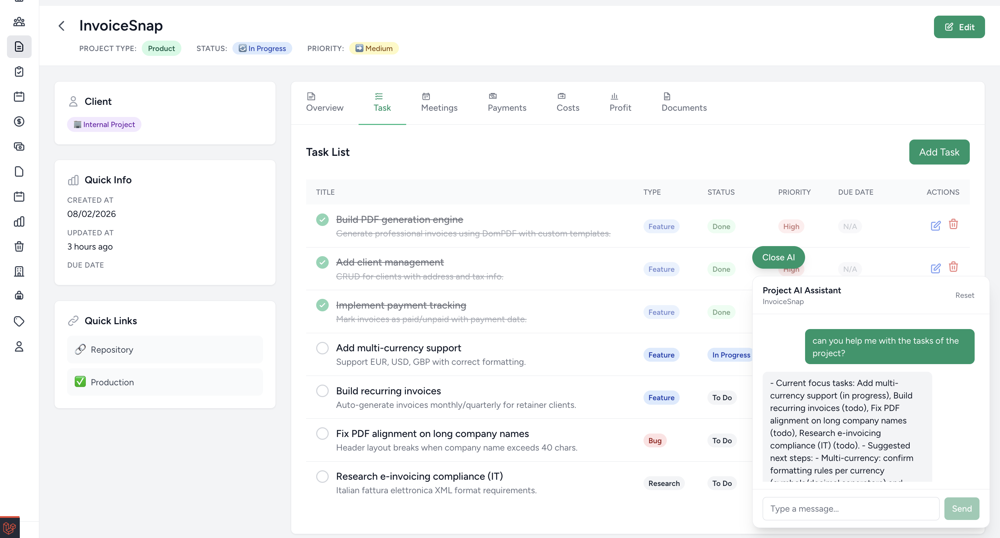
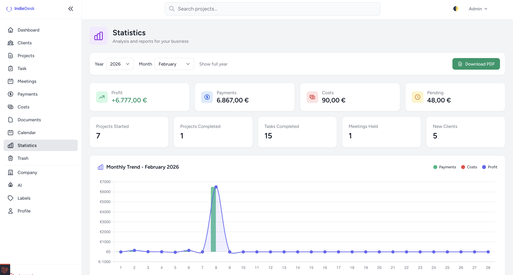

# IndieDesk

A self-hosted Laravel workspace for indie developers  
to track projects, revenue and costs, without spreadsheets.

▶ [Watch the demo on YouTube](https://www.youtube.com/watch?v=Z-LmKAyYH0k&t=1s)

---

## What is IndieDesk?

IndieDesk is a Laravel template designed around how indie developers
actually manage projects.

Instead of juggling spreadsheets, notes and tools, IndieDesk keeps
tasks, documents, costs, payments and stats tied to each project
with full control over your code and data.

You self-host it. You own it. You adapt it to your workflow.

---

## Who is this for?

IndieDesk is built for:

- Indie developers and solo founders  
- Freelancers managing multiple projects or revenue streams  
- Developers who want to own and customize their internal tools  

It’s probably **not** for you if:

- You’re looking for accounting or tax software  
- You want a hosted SaaS with subscriptions  
- You don’t plan to work with Laravel at all  

---

## Key features

- Project-based tracking for tasks, docs, costs and payments  
- Project overview with monthly and yearly stats  
- Invoice drafts generated per project  
- Customizable workflows (clean Laravel code)  
- Optional AI assistant with project context  
- GitHub integration (heatmap & commits)
- Tax Tracker

---

## Screenshots

### Project overview

### Dashboard

### Stats

---

## Tech stack

- Laravel  
- Blade  
- Tailwind CSS  
- Alpine.js 
- SQLite, Mysql 

---

Full documentation is available here:  
<a href="https://docs.indiedesk.link" target="_blank">Read the documentation</a>

Website:  
<a href="https://indiedesk.link" target="_blank">indiedesk.link</a>

Buy here:  
<a href="https://eugeniogiusti.gumroad.com/l/indiedesk" target="_blank">Buy IndieDesk</a>

---

Multi-language ready.
IndieDesk ships with built-in translations. No setup required.

🇬🇧 🇮🇹 🇪🇸 🇫🇷 🇩🇪 🇵🇹 🇳🇱 🇩🇰 🇷🇴 🇵🇱 🇷🇺 🇺🇦 🇨🇳
13 languages included.

---

## License

IndieDesk is a commercial Laravel template.

By purchasing a license, you are granted a non-exclusive,
non-transferable right to use the source code for your own
personal or commercial projects.

You may modify the code and run it on your own infrastructure.

Redistribution, resale, or sublicensing of the source code
or any derivative work is not permitted.

⸻

Built by an indie developer, for indie developers.